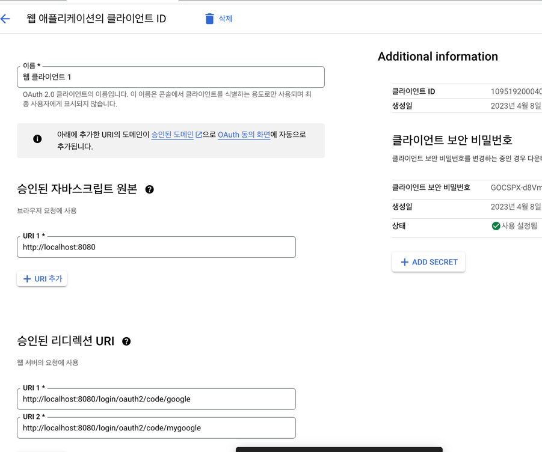
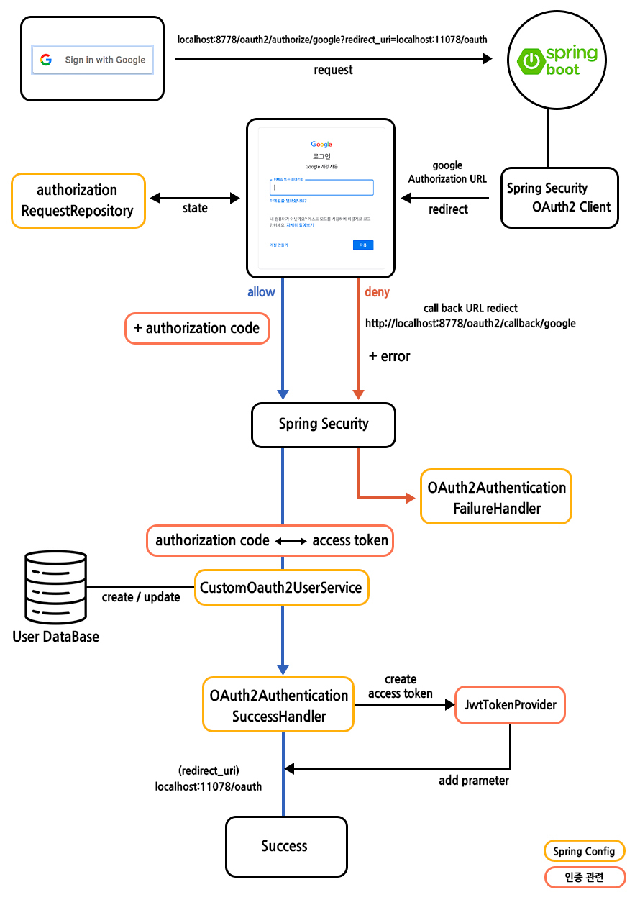

# oauth2 설정 방법
1. 구글 console에서 OAuth 2.0 클라이언트 ID 생성
2. security.oauth2.client.client-id, security.oauth2.client.client-secret 설정
3. security.oauth2.client.registered-redirect-uri 설정
4. security.oauth2.client.scope 설정

# 구글 console 설정 방법
https://console.cloud.google.com/apis/credentials/oauthclient




# 업무 흐름도 
1. <a href="/oauth2/authorization/google">Login with Google</a> 클릭
2. 구글 로그인 페이지로 이동
3. 구글 로그인 성공
4. 구글에서 /login/oauth2/code/google 로 리다이렉트
5. /login/oauth2/code/google 로 리다이렉트 되면서 구글에서 전달한 code를 파라미터로 전달
6. /login/oauth2/code/google 에서 code를 받아서 구글에 access token 요청
7. 구글에서 access token을 전달
8. /login/oauth2/code/google 에서 access token을 받아서 구글에 user info 요청
9. 구글에서 user info를 전달
10. /login/oauth2/code/google 에서 user info를 받아서 로그인 처리
 



# 정리 잘된 사이트
https://wildeveloperetrain.tistory.com/252


# 주의사항
- 로그인 성공 이후 임의의 페이지로 넘기고 싶다면 CustomAuthenticationSuccessHandler 만들어 주입 
- 시큐리티는 /login/oauth2/code/{registrationId} 패턴의 URL을 OAuth2 로그인 요청으로 인식한다.

# 주요 설정
```java
@Bean
public SecurityFilterChain securityFilterChain(HttpSecurity http) throws Exception {
    http
        .authorizeRequests((authorizeRequests) ->
                authorizeRequests
                        .requestMatchers("/", "/login", "/oauth/**").permitAll()
                        .anyRequest().authenticated()
        )

        .formLogin((formLogin) ->
                formLogin
                        .loginPage("/login")
                        .permitAll()
        )
        .oauth2Login((oauth2Login) ->
                oauth2Login
                        // 원래는 지정할 수 있어야 하지만 안됨!
                        // 시큐리티는 /login/oauth2/code/{registrationId} 패턴의 URL을 OAuth2 로그인 요청으로 인식한다.
                        // default :http://localhost:8080/login/oauth2/code/google
//                            .authorizationEndpoint((authorizationEndpoint) ->
//                                    authorizationEndpoint
//                                            .baseUri("/login/oauth2/code/mygoogle")
//                            )
                        .loginPage("/login")
                        .userInfoEndpoint(userInfoEndpoint ->
                                userInfoEndpoint
                                        .userService(oauthUserService)
                        ).successHandler(new CustomAuthenticationSuccessHandler())
        )

            .requestCache((requestCache) ->
                requestCache.requestCache(new NullRequestCache())
        );

    return http.build();
}
```